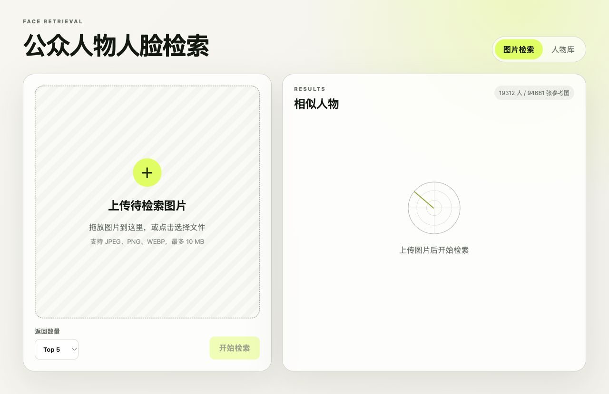
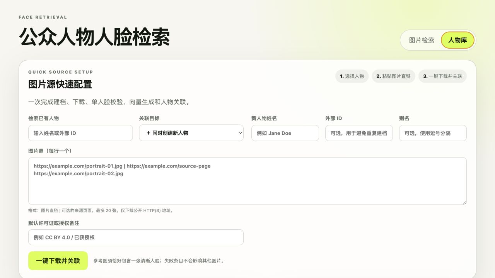
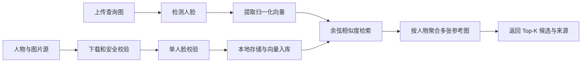

# Celebrity Face Search · 公众人物人脸检索

一个本地优先的公众人物人脸相似检索 MVP：上传图片，检测其中的人脸，与本地参考人物库进行向量检索，并返回按人物聚合的 Top-K 候选。

[](https://www.python.org/)
[](https://fastapi.tiangolo.com/)
[](https://github.com/opencv/opencv_zoo)
[](#测试)

> [!IMPORTANT]
> 相似度是模型特征距离，不是身份概率、身份确认或法律结论。本项目不判断肖像权、版权、隐私权或其他侵权责任。

## 界面预览

### 上传图片并检索相似人物



### 从图片源一键下载并关联人物



## 核心能力

- 浏览器上传、拖放、预览与多人脸查询；
- OpenCV YuNet 人脸检测和 SFace 人脸特征提取；
- 人物创建、删除、别名、外部 ID 和多参考图管理；
- 图片源一键配置：下载、格式验证、单人脸校验、向量生成和人物关联；
- 图片直链、来源页面和许可证/授权备注追溯；
- SQLite 元数据、本地文件存储和 NumPy 余弦相似度索引；
- 多参考图按人物聚合，返回 Top-K 人物候选；
- CelebA / VGGFace2 身份元数据及参考图断点导入；
- 私网地址拦截、重定向校验、下载大小限制和重复源幂等；
- FastAPI OpenAPI 文档、Docker 运行方式和自动化测试。

## 工作流程



## 快速开始

### 真实人脸检索模式

需要 Python 3.11 或更高版本，以及可访问 OpenCV 官方模型源的网络环境：

```bash
git clone https://github.com/yubowen123/celebrity-face-search.git
cd celebrity-face-search
./scripts/start_mvp.sh
```

首次启动会创建 `.venv`、安装依赖，并下载及校验约 37 MB 的 YuNet 与 SFace 模型。随后访问：

- 应用界面：<http://127.0.0.1:8000>
- API 文档：<http://127.0.0.1:8000/docs>
- 健康检查：<http://127.0.0.1:8000/api/health>

在另一个终端运行真实图片闭环演示：

```bash
source .venv/bin/activate
python3 scripts/seed_demo_library.py
```

演示脚本会从 Wikimedia Commons 下载带来源记录的公众人物图片，录入参考图并验证不同年份图片的 Top-1 检索。图片、模型和数据库都写入被 Git 忽略的 `data/`。

### 轻量流程演示模式

`demo` 引擎只使用整图颜色与灰度特征，用于验证界面和数据流程，不具备真实身份识别能力：

```bash
python3 -m venv .venv
source .venv/bin/activate
pip install -r requirements.txt
FACE_ENGINE=demo uvicorn app.main:app --reload
```

### Docker / DeepFace 可选模式

```bash
docker compose up --build
```

也可以在兼容环境中直接安装：

```bash
pip install -r requirements-deepface.txt
FACE_ENGINE=deepface uvicorn app.main:app --reload
```

DeepFace 框架许可证不自动覆盖其加载的模型权重和训练数据，请分别核对用途限制。

## 三分钟使用流程

1. 打开“人物库”，创建人物或选择已有身份。
2. 手工上传一张单人参考图，或使用“图片源快速配置”批量导入。
3. 回到“图片检索”，上传待检索图片。
4. 选择返回数量并开始检索。
5. 查看候选人物、模型相似度、最佳参考图及其来源。

真实人脸引擎下，每张参考图必须恰好检测到一张人脸。建议每个人物录入 3—10 张不同年龄、角度、光线和妆容的合法参考图片。

## 图片源一键配置

在“人物库 → 图片源快速配置”中选择已有身份，或在同一次操作中创建人物。每行填写一个图片直链，竖线右侧可填写可核验的来源页面：

```text
https://images.example.org/person/portrait-01.jpg | https://example.org/photo-page-01
https://images.example.org/person/portrait-02.jpg | https://example.org/photo-page-02
```

点击“一键下载并关联”后，系统逐张执行：

1. 验证公开 HTTP(S) 地址并阻止本机、私网和保留 IP；
2. 校验每次重定向，限制连接时间、响应大小和跳转次数；
3. 验证 JPEG、PNG 或 WEBP 的真实文件内容；
4. 要求图片恰好包含一张可检测人脸；
5. 保存本地图片、来源和许可证记录，生成向量并关联人物；
6. 汇总成功、重复跳过和失败条目，并重载检索索引。

每次最多处理 20 个图片源；同一人物重复提交相同图片直链时会自动跳过。

## API 快速示例

创建人物：

```bash
curl -X POST http://127.0.0.1:8000/api/library/persons \
  -H 'Content-Type: application/json' \
  -d '{"name":"Example Person","external_id":"wikidata:Q0000","aliases":[]}'
```

使用远程图片源创建人物并导入参考图：

```bash
curl -X POST http://127.0.0.1:8000/api/library/quick-source-import \
  -H 'Content-Type: application/json' \
  -d '{
    "person": {"name": "Example Person", "external_id": "example:person"},
    "sources": [{
      "image_url": "https://images.example.org/portrait.jpg",
      "source_page_url": "https://example.org/photo-page",
      "license_code": "CC BY 4.0"
    }]
  }'
```

上传图片检索：

```bash
curl -X POST http://127.0.0.1:8000/api/search \
  -F 'image=@./query.jpg' \
  -F 'top_k=5'
```

完整字段、响应和错误处理示例见 [`docs/API使用示例.md`](docs/API使用示例.md)。

## 本地目录批量导入

准备目录：

```text
my-library/
├── Person A/
│   ├── 01.jpg
│   └── 02.jpg
└── Person B/
    ├── 01.jpg
    └── 02.jpg
```

执行导入：

```bash
python3 scripts/import_library.py ./my-library --license "CC BY 4.0"
```

## CelebA 与 VGGFace2

仓库不包含 CelebA、VGGFace2 图片、人物向量或模型权重。导入器只在本地下载和处理数据，并支持断点恢复。

```bash
source .venv/bin/activate
python3 scripts/import_research_datasets.py bootstrap --dataset all
python3 scripts/import_research_datasets.py celeba --images-per-identity 5
python3 scripts/import_research_datasets.py download-vgg --which all
python3 scripts/import_research_datasets.py vggface2 --which all --images-per-identity 5
python3 scripts/import_research_datasets.py status
```

- CelebA 只公开匿名 `celeb_id`，库内显示为 `CelebA #00001` 等匿名身份；
- VGGFace2 使用其 `identity_meta.csv` 中的身份名称；
- 两个数据集均有各自的用途、访问和再分发限制；
- 请勿把研究数据集或网络图片直接当作可商用人物库。

详细来源、容量、断点和恢复方式见 [`docs/数据集导入说明.md`](docs/数据集导入说明.md)。

## 配置

复制 `.env.example`，或直接设置环境变量：

| 变量 | 默认值 | 说明 |
|---|---|---|
| `APP_DATA_DIR` | `./data` | SQLite、模型和参考图片目录 |
| `FACE_ENGINE` | `opencv_sface` | `opencv_sface`、`demo` 或 `deepface` |
| `OPENCV_MODEL_DIR` | `./data/models` | YuNet 和 SFace 模型目录 |
| `OPENCV_DETECTION_THRESHOLD` | `0.75` | YuNet 人脸检测阈值 |
| `DEEPFACE_MODEL` | `Facenet512` | DeepFace 模型名称 |
| `DEEPFACE_DETECTOR` | `opencv` | DeepFace 检测器 |
| `MAX_UPLOAD_MB` | `10` | 单张上传或下载图片大小限制 |
| `SEARCH_TOP_K` | `5` | 默认候选人物数量 |

更换人脸模型后，历史向量通常不兼容，需要使用同一模型重新生成人物库向量。

## 项目结构

```text
app/
├── main.py            # FastAPI 路由和业务闭环
├── face_engine.py     # Demo、OpenCV SFace、DeepFace 引擎
├── repository.py      # SQLite 元数据和 NumPy 向量索引
├── source_import.py   # 远程图片下载与 SSRF 防护
└── static/            # 浏览器界面
scripts/               # 启动、模型、演示和数据集导入脚本
tests/                 # API 与图片源安全测试
docs/                  # API、数据集和验收说明
data/                  # 本地数据，不进入 Git
```

## 测试

```bash
source .venv/bin/activate
pytest -q
python3 -m compileall -q app scripts tests
node --check app/static/app.js
docker compose config --quiet
```

当前自动化结果：`8 passed`。

## 数据规模与生产化

当前 NumPy 内存索引适合 MVP 和约十万张以内的参考图片。更大规模建议替换为 Qdrant、Milvus 或 Faiss，并补充：

- 基于真实正负样本的阈值标定、ROC 和误报率报告；
- 人脸质量、年龄跨度和生成图域偏移评估；
- 鉴权、审计日志、速率限制和数据删除流程；
- 向量版本、模型版本及批量重建机制；
- 数据处理依据、保留期限和用户权利响应流程。

## 安全、隐私与法律边界

- 不要把 API 直接暴露到公网；当前 MVP 没有用户认证和租户隔离；
- 只导入具有合法处理依据、可核验来源和适用授权的图片；
- 人脸向量可能属于敏感生物识别数据，应按适用法律和组织政策保护；
- 图片来源记录只用于追溯，不代表自动获得版权或肖像授权；
- 检索结果需要人工复核，不应作为执法、雇佣、信贷等高风险决定的唯一依据。

安全问题报告方式见 [`SECURITY.md`](SECURITY.md)，参与开发前请阅读 [`CONTRIBUTING.md`](CONTRIBUTING.md)。

## 许可证状态

本仓库目前未附加代码开源许可证。**公开可见不等于授予复制、修改或再分发权利。** 若准备接受外部使用和贡献，请由仓库所有者明确选择并添加 MIT、Apache-2.0 或其他适用许可证；模型、数据集与图片仍需分别遵守各自条款。
