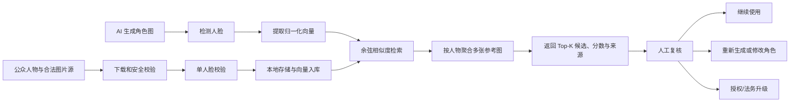

# AI Character Likeness Risk Scanner · AI 短剧角色图相似性风险初筛

一个面向 **AI 短剧、漫剧和虚拟角色生产** 的本地优先风控辅助工具。上传 AI 生成的角色图后，系统将其中的人脸与可追溯的公众人物参考库进行向量检索，提示可能接近的明星或公众人物，帮助创作团队在发布前决定：继续使用、重新生成、补充人工复核，或进入授权/法务审查。

它解决的是“生成角色无意间长得太像真实人物，团队却没有及时发现”的问题。当前 MVP 提供 **人脸相似性证据和来源线索**，不自动作出侵权结论。

[](https://www.python.org/)
[](https://fastapi.tiangolo.com/)
[](https://github.com/opencv/opencv_zoo)
[](#测试)

> [!IMPORTANT]
> 本项目是发布前风险初筛工具，不是法律服务、身份确认系统或“侵权检测器”。相似度是模型特征距离，不是侵权概率；低分也不保证安全，高分也不等于侵权。最终判断需结合使用地区、传播方式、商业场景、授权状态、角色设定和人工复核。

## 产品目的

AI 生成角色可能在没有明确提示词指向的情况下，意外呈现某位真实人物的可识别面部特征。该项目把公众人物相似检索嵌入短剧资产审核环节：

- **生成后初筛**：批量角色图进入分镜、视频或宣发前，先检查可能的真实人物近似；
- **候选提示**：返回 Top-K 公众人物候选、最佳参考图和来源，而不是只给一个难以解释的分数；
- **重生成决策**：对显著近似的角色图，优先调整种子、脸型、五官组合或角色设计；
- **人工升级**：涉及知名人物、商业投放、传记性角色或有意模仿时，进入授权与法务复核；
- **证据留痕基础**：保留参考图片直链、来源页面和许可证/授权备注，便于审查人员回溯。

## 界面预览

### 上传 AI 角色图并检索相似公众人物


### 建立可追溯的公众人物参考库


## 核心能力

- 浏览器上传 AI 角色图、拖放、预览与多人脸查询；
- OpenCV YuNet 人脸检测和 SFace 人脸特征提取；
- 人物创建、删除、别名、外部 ID 和多参考图管理；
- 图片源一键配置：下载、格式验证、单人脸校验、向量生成和人物关联；
- 图片直链、来源页面和许可证/授权备注追溯；
- SQLite 元数据、本地文件存储和 NumPy 余弦相似度索引；
- 多参考图按人物聚合，返回 Top-K 公众人物候选和来源；
- CelebA / VGGFace2 身份元数据及参考图断点导入；
- 私网地址拦截、重定向校验、下载大小限制和重复源幂等；
- FastAPI OpenAPI 文档、Docker 运行方式和自动化测试。

## 短剧角色图风控流程



当前代码实现到“返回候选、分数与来源”。风险等级、阈值版本、审核结论和项目级审批流属于下一阶段，不应把未经标定的相似度直接映射为“安全/侵权”。

## 快速开始

### 真实人脸检索模式

需要 Python 3.11 或更高版本，以及可访问 OpenCV 官方模型源的网络环境：

```bash
git clone https://github.com/yubowen123/celebrity-face-search.git
cd celebrity-face-search
./scripts/start_mvp.sh
```

首次启动会创建 `.venv`、安装依赖，并下载及校验约 37 MB 的 YuNet 与 SFace 模型。随后访问：

- 应用界面：<http://127.0.0.1:8000>
- API 文档：<http://127.0.0.1:8000/docs>
- 健康检查：<http://127.0.0.1:8000/api/health>

在另一个终端运行真实图片闭环演示：

```bash
source .venv/bin/activate
python3 scripts/seed_demo_library.py
```

演示脚本会从 Wikimedia Commons 下载带来源记录的公众人物图片，录入参考图并验证不同年份图片的 Top-1 检索。图片、模型和数据库都写入被 Git 忽略的 `data/`。

### 轻量流程演示模式

`demo` 引擎只使用整图颜色与灰度特征，用于验证界面和数据流程，不具备真实身份识别能力：

```bash
python3 -m venv .venv
source .venv/bin/activate
pip install -r requirements.txt
FACE_ENGINE=demo uvicorn app.main:app --reload
```

### Docker / DeepFace 可选模式

```bash
docker compose up --build
```

也可以在兼容环境中直接安装：

```bash
pip install -r requirements-deepface.txt
FACE_ENGINE=deepface uvicorn app.main:app --reload
```

DeepFace 框架许可证不自动覆盖其加载的模型权重和训练数据，请分别核对用途限制。

## 三分钟角色图筛查流程

1. 在“人物库”录入需要重点关注的海外明星或公众人物，并保留图片来源。
2. 每位人物准备多张跨年龄、角度、光线和妆容的合法参考图。
3. 回到“图片检索”，上传待发布的 AI 短剧角色图。
4. 查看 Top-K 候选、聚合相似度、最佳参考图及其来源。
5. 对显著近似或无法排除的结果进行人工复核，必要时重新生成或升级授权/法务审查。

真实人脸引擎下，每张参考图必须恰好检测到一张人脸。建议每个人物录入 3—10 张不同年龄、角度、光线和妆容的合法参考图片。

## 当前能检查什么

| 风险维度 | 当前 MVP | 说明 |
|---|---:|---|
| AI 角色脸与公众人物脸部特征近似 | ✅ | 返回 Top-K 候选、单图和聚合相似度 |
| 最佳参考图来源与许可证备注 | ✅ | 用于人工回溯，不代表授权有效性已核验 |
| 多人角色图逐脸检索 | ✅ | 每张检测到的人脸分别返回候选 |
| 自动判定侵权或给出法律结论 | ❌ | 不同法域、用途、表达和授权状态不能由人脸分数决定 |
| 姓名、声音、表演风格、服装和标志性造型 | ❌ | 需要额外的文本、音频和多模态审核能力 |
| 具体摄影作品、影视画面或美术作品复制 | ❌ | 人脸向量不能替代版权相似性分析 |
| AI 内容标识、合同和授权链审查 | ❌ | 应由发布平台、制片流程和专业人员完成 |

详细 SOP、结果解释、阈值标定方法和人工审核清单见 [`docs/AI短剧角色图风险筛查指南.md`](docs/AI短剧角色图风险筛查指南.md)。

## 如何解释相似度

- 分数只在 **同一人脸模型、同一预处理和同一参考库版本** 下可比较；
- 不存在适用于所有人群、画风和生成模型的通用“侵权阈值”；
- Top-1 与 Top-2 的差距、同一人物多张参考图是否持续接近，通常比孤立单分数更有参考价值；
- 动漫化、年龄变化、侧脸、浓妆、遮挡和生成模型域偏移都可能造成漏报或误报；
- 正式使用前应以本团队的 AI 角色图建立正负验证集，测量误报率和漏报率后再设置内部升级阈值。

## 图片源一键配置

在“人物库 → 图片源快速配置”中选择已有身份，或在同一次操作中创建人物。每行填写一个图片直链，竖线右侧可填写可核验的来源页面：

```text
https://images.example.org/person/portrait-01.jpg | https://example.org/photo-page-01
https://images.example.org/person/portrait-02.jpg | https://example.org/photo-page-02
```

点击“一键下载并关联”后，系统逐张执行：

1. 验证公开 HTTP(S) 地址并阻止本机、私网和保留 IP；
2. 校验每次重定向，限制连接时间、响应大小和跳转次数；
3. 验证 JPEG、PNG 或 WEBP 的真实文件内容；
4. 要求图片恰好包含一张可检测人脸；
5. 保存本地图片、来源和许可证记录，生成向量并关联人物；
6. 汇总成功、重复跳过和失败条目，并重载检索索引。

每次最多处理 20 个图片源；同一人物重复提交相同图片直链时会自动跳过。

## API 快速示例

创建人物：

```bash
curl -X POST http://127.0.0.1:8000/api/library/persons \
  -H 'Content-Type: application/json' \
  -d '{"name":"Example Person","external_id":"wikidata:Q0000","aliases":[]}'
```

使用远程图片源创建人物并导入参考图：

```bash
curl -X POST http://127.0.0.1:8000/api/library/quick-source-import \
  -H 'Content-Type: application/json' \
  -d '{
    "person": {"name": "Example Person", "external_id": "example:person"},
    "sources": [{
      "image_url": "https://images.example.org/portrait.jpg",
      "source_page_url": "https://example.org/photo-page",
      "license_code": "CC BY 4.0"
    }]
  }'
```

上传图片检索：

```bash
curl -X POST http://127.0.0.1:8000/api/search \
  -F 'image=@./query.jpg' \
  -F 'top_k=5'
```

完整字段、响应和错误处理示例见 [`docs/API使用示例.md`](docs/API使用示例.md)。

## 本地目录批量导入

准备目录：

```text
my-library/
├── Person A/
│   ├── 01.jpg
│   └── 02.jpg
└── Person B/
    ├── 01.jpg
    └── 02.jpg
```

执行导入：

```bash
python3 scripts/import_library.py ./my-library --license "CC BY 4.0"
```

## CelebA 与 VGGFace2

仓库不包含 CelebA、VGGFace2 图片、人物向量或模型权重。导入器只在本地下载和处理数据，并支持断点恢复。

```bash
source .venv/bin/activate
python3 scripts/import_research_datasets.py bootstrap --dataset all
python3 scripts/import_research_datasets.py celeba --images-per-identity 5
python3 scripts/import_research_datasets.py download-vgg --which all
python3 scripts/import_research_datasets.py vggface2 --which all --images-per-identity 5
python3 scripts/import_research_datasets.py status
```

- CelebA 只公开匿名 `celeb_id`，库内显示为 `CelebA #00001` 等匿名身份；
- VGGFace2 使用其 `identity_meta.csv` 中的身份名称；
- 两个数据集均有各自的用途、访问和再分发限制；
- 请勿把研究数据集或网络图片直接当作可商用人物库。

详细来源、容量、断点和恢复方式见 [`docs/数据集导入说明.md`](docs/数据集导入说明.md)。

## 配置

复制 `.env.example`，或直接设置环境变量：

| 变量 | 默认值 | 说明 |
|---|---|---|
| `APP_DATA_DIR` | `./data` | SQLite、模型和参考图片目录 |
| `FACE_ENGINE` | `opencv_sface` | `opencv_sface`、`demo` 或 `deepface` |
| `OPENCV_MODEL_DIR` | `./data/models` | YuNet 和 SFace 模型目录 |
| `OPENCV_DETECTION_THRESHOLD` | `0.75` | YuNet 人脸检测阈值 |
| `DEEPFACE_MODEL` | `Facenet512` | DeepFace 模型名称 |
| `DEEPFACE_DETECTOR` | `opencv` | DeepFace 检测器 |
| `MAX_UPLOAD_MB` | `10` | 单张上传或下载图片大小限制 |
| `SEARCH_TOP_K` | `5` | 默认候选人物数量 |

更换人脸模型后，历史向量通常不兼容，需要使用同一模型重新生成人物库向量。

## 项目结构

```text
app/
├── main.py            # FastAPI 路由和业务闭环
├── face_engine.py     # Demo、OpenCV SFace、DeepFace 引擎
├── repository.py      # SQLite 元数据和 NumPy 向量索引
├── source_import.py   # 远程图片下载与 SSRF 防护
└── static/            # 浏览器界面
scripts/               # 启动、模型、演示和数据集导入脚本
tests/                 # API 与图片源安全测试
docs/                  # API、数据集和验收说明
data/                  # 本地数据，不进入 Git
```

## 测试

```bash
source .venv/bin/activate
pytest -q
python3 -m compileall -q app scripts tests
node --check app/static/app.js
docker compose config --quiet
```

当前自动化结果：`8 passed`。

## 风控系统生产化

当前 NumPy 内存索引适合 MVP 和约十万张以内的参考图片。更大规模建议替换为 Qdrant、Milvus 或 Faiss，并补充：

- 基于真实正负样本的阈值标定、ROC 和误报率报告；
- 人脸质量、年龄跨度和生成图域偏移评估；
- 项目、剧集、角色和图片版本维度的审核记录；
- “通过初筛 / 重新生成 / 人工升级 / 已授权例外”决策状态；
- 声音、姓名、角色文案、标志性造型和具体作品复制的多模态检查；
- 鉴权、审计日志、速率限制和数据删除流程；
- 向量版本、模型版本及批量重建机制；
- 数据处理依据、保留期限和用户权利响应流程。

## 安全、隐私与法律边界

- 不要把 API 直接暴露到公网；当前 MVP 没有用户认证和租户隔离；
- 只导入具有合法处理依据、可核验来源和适用授权的图片；
- 人脸向量可能属于敏感生物识别数据，应按适用法律和组织政策保护；
- 图片来源记录只用于追溯，不代表自动获得版权或肖像授权；
- “未检出显著候选”只表示当前模型和当前人物库没有找到，不代表角色图可以无风险发布；
- 检索结果必须结合人工复核，不应用于确认真实人物身份，也不应作为高风险决定的依据。

法律与合规参考、适用边界见 [`docs/AI短剧角色图风险筛查指南.md`](docs/AI短剧角色图风险筛查指南.md)。安全问题报告方式见 [`SECURITY.md`](SECURITY.md)，参与开发前请阅读 [`CONTRIBUTING.md`](CONTRIBUTING.md)。

## 许可证状态

本仓库目前未附加代码开源许可证。**公开可见不等于授予复制、修改或再分发权利。** 若准备接受外部使用和贡献，请由仓库所有者明确选择并添加 MIT、Apache-2.0 或其他适用许可证；模型、数据集与图片仍需分别遵守各自条款。
