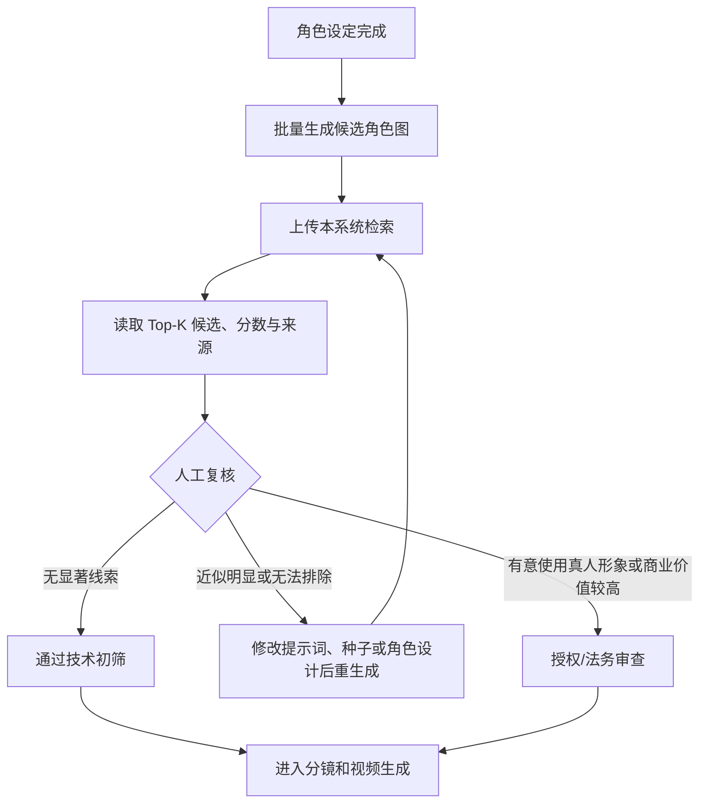

# AI 短剧角色图相似性风险筛查指南

## 1. 目的

本指南用于把公众人物人脸检索能力接入 AI 短剧角色资产审核。系统的目标不是自动判定侵权，而是尽早发现“AI 角色图可能与真实明星或公众人物高度近似”的线索，降低角色进入分镜、视频生成、宣发和商业投放后才被发现的返工风险。

建议产品名称使用：

- AI 角色图相似性风险初筛；
- 公众人物近似候选检索；
- AI 短剧角色发布前风控辅助。

不建议使用：

- 自动侵权检测；
- 百分百规避肖像权；
- 明星撞脸概率或侵权概率；
- 法律合规自动判定。

## 2. 推荐审核节点

至少在以下三个节点重复筛查：

1. **角色定妆图确定前**：修改成本最低；
2. **关键分镜首帧生成后**：生成模型可能改变或强化面部特征；
3. **海报、封面和商业投放前**：曝光和商业关联风险更高。

## 3. 当前系统输出

系统对查询图中每张人脸返回：

- 人脸检测框和检测置信度；
- Top-K 公众人物候选；
- 最佳单张参考图的余弦相似度；
- 同一人物多参考图的聚合相似度；
- 最佳参考图、来源页面和许可证/授权备注。

这些字段用于定位人工复核对象。它们不回答以下问题：

- 是否构成法律上的“可识别”或“混淆”；
- 是否属于新闻、评论、戏仿、传记、艺术表达等例外或抗辩；
- 是否已有演员、经纪公司、摄影师或权利人授权；
- 角色姓名、声音、动作、服装、道具和宣传文案是否共同指向某位真人；
- 角色图是否复制了某张具体摄影作品或影视画面。

## 4. 如何设置内部升级阈值

不要直接把一个经验分数写成“侵权线”。不同模型、画风、人群和参考图质量会改变分数分布。

推荐建立项目自己的验证集：

1. 收集已确认不以真人为原型的 AI 角色图，作为普通负样本；
2. 在获得合法测试依据的前提下，准备刻意近似或已知同身份的测试样本；
3. 按身份拆分训练/标定与验证数据，避免同图或近重复图泄漏；
4. 分别覆盖写实、半写实、动漫化、不同年龄、侧脸、妆容和遮挡；
5. 计算 ROC、召回率、误报率，并根据业务更不能接受漏报还是误报选择升级阈值；
6. 记录模型名称、模型文件哈希、检测阈值、人物库版本和标定日期；
7. 更换模型、参考库或主要生成模型后重新标定。

人工复核时同时观察：

- Top-1 是否明显高于其他候选；
- 同一人物的多张参考图是否持续进入高位；
- 最佳匹配是否只来自一张异常参考图；
- 肉眼是否能从脸型、五官比例和整体辨识度联想到同一人物；
- 发型、妆容、服装、道具、角色名称和剧情身份是否进一步强化指向。

## 5. 建议的审核结论

| 结论 | 含义 | 后续动作 |
|---|---|---|
| 通过技术初筛 | 当前模型与人物库未发现需要升级的线索 | 仍需完成版权、来源和内容审核 |
| 重新生成 | 近似明显，但没有使用真人形象的创作目的 | 修改种子、脸型、五官组合、年龄或角色设计后复检 |
| 人工升级 | 候选稳定、肉眼可联想，或用途具有较强商业关联 | 暂停发布，交由制片、授权或法务人员复核 |
| 已授权例外 | 已获得适用范围内的授权或有明确项目依据 | 记录权利人、地域、期限、媒体、用途和授权文件位置 |

不要把“通过技术初筛”简写为“无侵权风险”。

## 6. 人工复核清单

### 人脸与身份指向

- 是否有一个候选人物在多张参考图上持续接近？
- 普通观众是否可能直接联想到该人物？
- 角色名称、职业、经历、台词或宣传文案是否强化这种联想？
- 是否同时模仿了声音、口头禅、动作或表演风格？

### 图片与作品来源

- 生成图是否疑似复现某张具体照片的构图、服装、姿态或光影？
- 入库参考图是否记录图片直链、来源页面、作者和许可证？
- 参考图可用于人脸库处理，是否等于可用于短剧成片或商业宣传？通常不能直接画等号。

### 使用与传播

- 内容是内部概念验证、正式成片、广告素材还是付费投放？
- 发布地区和平台有哪些？
- 是否明确标注内容由 AI 生成或处理？
- 是否涉及未成年人、已故人物或政治人物等需要额外审查的类别？

### 记录建议

- 项目、剧集、角色和图片版本；
- 查询时间、模型版本和人物库版本；
- Top-K 候选和关键参考图来源；
- 审核结论、审核人、理由和复检记录；
- 授权文件的内部索引，不要把合同或个人信息提交到公开仓库。

## 7. 法律与合规参考

以下链接用于说明为什么系统只能作为辅助证据，不构成特定项目的法律意见。法律会随法域、时间、用途和事实变化，正式发行前应由熟悉目标市场的专业人员复核。

| 主题 | 官方来源 | 与本项目的关系 |
|---|---|---|
| 中国敏感个人信息 | [《中华人民共和国个人信息保护法》第二十七至三十条（国家市场监督管理总局）](https://www.samr.gov.cn/wljys/gzzd/art/2023/art_3ef1e889c1e644d4b65b5f5c7f432386.html) | 生物识别属于敏感个人信息；公开信息也不当然意味着可以无限制处理 |
| 欧盟生物识别数据 | [GDPR Article 4(14) 与 Article 9（EUR-Lex）](https://eur-lex.europa.eu/eli/reg/2016/679/oj) | 人脸特征处理可能涉及生物识别数据及特殊类别数据规则 |
| 欧盟 AI 内容透明度 | [EU AI Act Article 50（EUR-Lex）](https://eur-lex.europa.eu/eli/reg/2024/1689/oj) | 对构成 deep fake 的生成或处理图像、音频、视频规定透明度义务，并对艺术或虚构作品作出相应安排 |
| 美国加州形象商业使用 | [California Civil Code §3344](https://leginfo.legislature.ca.gov/faces/codes_displaySection.xhtml?lawCode=CIV&sectionNum=3344.) | 涉及未经同意使用姓名、声音、签名、照片或 likeness 的特定商业使用；条文也包含适用边界与例外 |
| 数字替身政策 | [U.S. Copyright Office: Copyright and Artificial Intelligence](https://www.copyright.gov/ai/) | 美国版权局的 Part 1 专门讨论数字替身及现有保护缺口，说明单靠版权分析不足以覆盖所有真人形象风险 |

## 8. 数据与部署边界

- CelebA、VGGFace2 以及网络公众人物图片具有各自的访问和使用条件，不因导入本系统而获得商业授权；
- 人脸参考图、向量和身份映射应保存在受控环境，不应进入公开 Git 仓库；
- 当前 MVP 没有用户认证、租户隔离和审计日志，不应直接暴露在公网；
- 若用于商业制作，应建立删除、更正、访问控制、保留期限和事件响应流程；
- 系统输出应由人复核，并和生成工具、素材版权、演员授权及发布平台规则一起审查。

## 9. 一句话边界

本系统帮助团队更早发现“可能撞脸”的 AI 角色图，但不能证明一张图一定侵权，也不能证明一张图一定安全。

